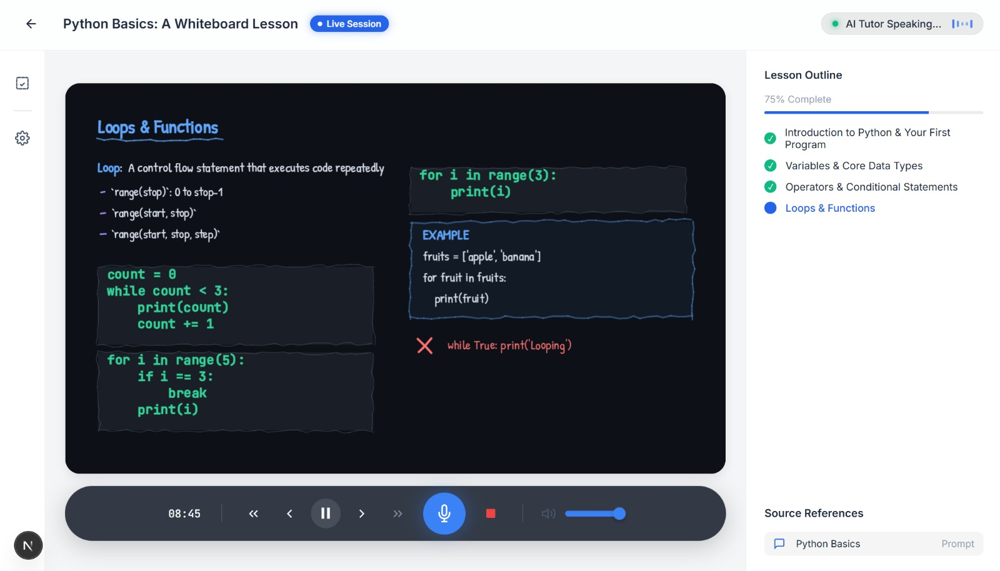
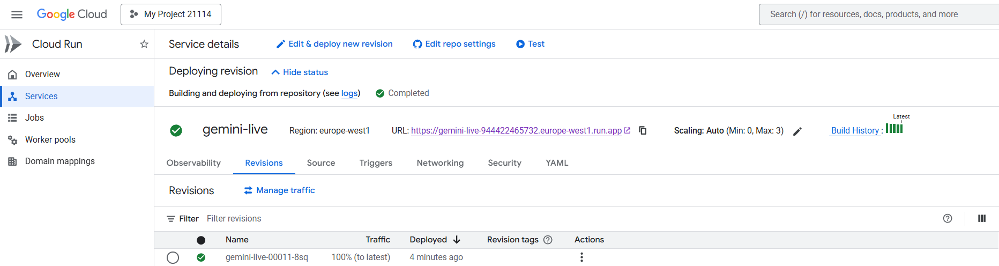

# Smart Lecture APP

**Smart Lecture APP** is an innovative, interactive educational platform powered by the **Gemini Live API**. This cutting-edge app is designed to deliver a live classroom experience where students can interact with an AI professor, ask real-time questions, and receive explanations with dynamic visual aids. The platform takes online education to the next level by creating an engaging, personalized, and immersive learning environment.

### **The Core Idea**

Traditional online learning methods often lack interactivity and personalized feedback. **Smart Lecture APP** aims to solve these challenges by offering an AI-powered professor that not only delivers structured lessons but also adapts in real-time to the student’s needs.

- **Real-Time Voice Interaction**: Students can ask questions or request clarifications, and the AI responds instantly.
- **Dynamic Whiteboard**: The AI uses a digital whiteboard to draw equations, diagrams, and other visual aids that are updated in real-time based on the student’s queries.
- **Interactive Learning**: Unlike traditional passive learning, students can interact with the AI, ask questions during lessons, and even pause the lecture to get answers immediately.
- **Multimodal Learning**: The combination of voice, text, and visual aids provides a holistic learning experience, making complex concepts more accessible and easier to understand.

The **Smart Lecture APP** transforms passive learning into active engagement by providing a virtual classroom experience where learning is personalized, interactive, and visually rich.

## **Key Features**

- **AI Professor**: Delivers live lessons, answers questions, and interacts with the student in real-time.
- **Dynamic Whiteboard**: Displays live visualizations that sync with the AI professor’s explanations.
- **Real-Time Feedback**: The app pauses for questions and answers, then resumes the lesson seamlessly.
- **Multimodal Learning**: Students receive both audio and visual explanations, improving comprehension.

### **Problem Solved**

The **Smart Lecture APP** addresses key challenges in traditional online education:

1. **Lack of interactivity**: Students often struggle to understand concepts without the ability to ask questions in real time.
2. **Difficulty with complex concepts**: Visual aids like equations and diagrams are hard to follow in static video lessons or textbooks.
3. **Engagement**: Traditional online courses are often passive, and students can lose interest or fail to grasp material.

By combining AI with a dynamic whiteboard and real-time voice interaction, **Smart Lecture APP** provides a solution that actively engages students and helps them understand complex topics.

> **The AI Professor explaining energy conservation concepts**: The professor interacts with the whiteboard, explaining important concepts with visuals that update in real time.

### *System Architecture Overview*

The diagram below illustrates the key components and data flow within the **Smart Lecture APP** system:

> **System Architecture**: A detailed diagram of how the frontend, backend, and Gemini Live API interact to create a seamless learning experience.

## **Deployment on Google Cloud Run**

The **Smart Lecture APP** is deployed on **Google Cloud Run**, which allows seamless, scalable, and serverless hosting of the application. Google Cloud Run automatically scales the service up or down based on traffic, ensuring efficiency and cost-effectiveness.

Here’s a screenshot of the **Cloud Run Dashboard** where the app is deployed:

Website: https://gemini-live-944422465732.europe-west1.run.app/

Api: https://api-55200224265.europe-west1.run.app/

## **Additional Media**

### Watch the Demo:

Check out the demo video of **Smart Lecture APP** on YouTube:

▶️ [Watch the demo](https://youtu.be/6jEPjU2U6uk)

> **YouTube Demo Video**: The video provides a comprehensive look at how the AI professor teaches, answers questions, and uses the whiteboard to explain concepts in real time.

---

This project combines cutting-edge AI technology with educational tools to create an interactive, engaging, and effective learning experience. With the **Smart Lecture APP**, students can experience a personalized classroom environment from anywhere, anytime.

